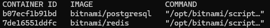
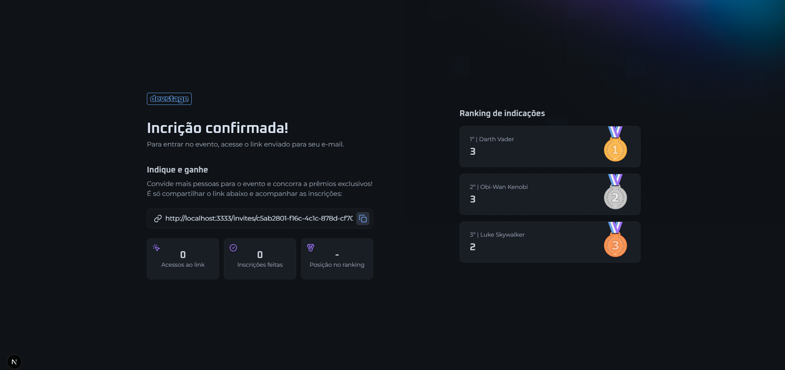
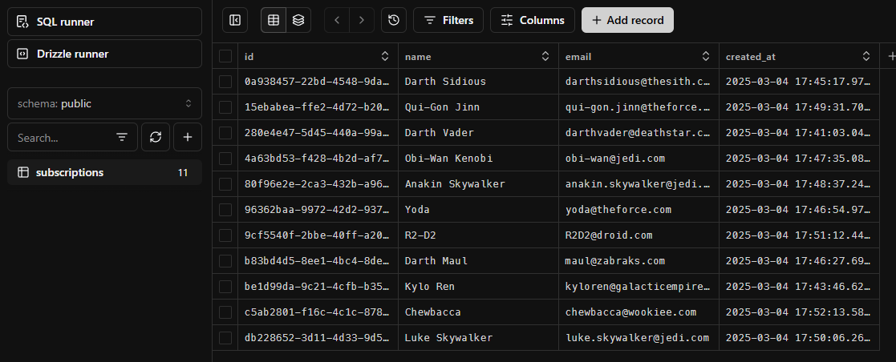
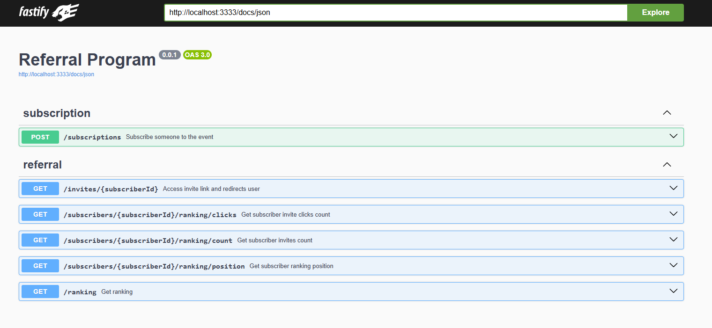
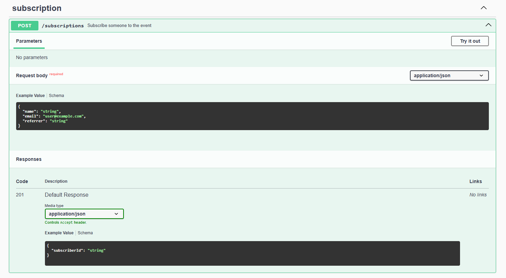

Projeto desenvolvido com [Node.js](https://nodejs.org/pt).

## Para começar:

Para iniciar o projeto, você deve rodar o comando:

```bash
npm install
# or
yarn install
# or
pnpm install
```
E Depois:

```bash
npm run dev:ts
# or
yarn run dev:ts
# or
pnpm run dev:ts
```

## O projeto

Está é a parte do backend da aplicação, a parte do frontend se encontra no repositório [referral-program-frontend](https://github.com/patrick-cuppi/referral-program-frontend).
O Projeto consiste em um sistema de cadastro para um evento de programação, solicitando nome e e-mail.
Após a confirmação do cadastro, ele gera um link para você convidar outras pessoas, e quando a pessoa faz a inscrição através do seu link,
ele vai gerando uma pontuação, onde há um ranking (os 3 primeiros) com as pessoas que mais tiveram inscritos a partir do seu link.
Quando você acessa a URL da sua inscrição, nela aparecerá também a quantidade de pessoas que abriram seu link, a quantidade de inscrição e seu lugar no ranking.
Abaixo se encontra as telas do projeto:

**Container do PostgreSQL e Redis e suas imagens (bitnami)**


**Ranking (Integração do Backend com o Frontend)**


**Tabela do Banco de Dados (Drizzle-kit studio)**


**Swagger - Tela inicial**


**Swagger - Documentação de uma das Rotas (POST)**


Toda a documentação de rotas e os parâmetros necessários estão no Swagger, como mostra as imagens acima.
Para acessá-la, basta acessar: http://localhost:{porta que você irá utilizar}/docs. 

## Tecnologias utilizadas

Para a construção do projeto, foram utilizadas as seguintes tecnologias:
- TypeScript
- Node.js
- Fastify 
- Zod
- tsup
- tsx
- Biome
- Swagger
- Cors
- Drizzle ORM
- PostgreSQL
- Redis
- Docker